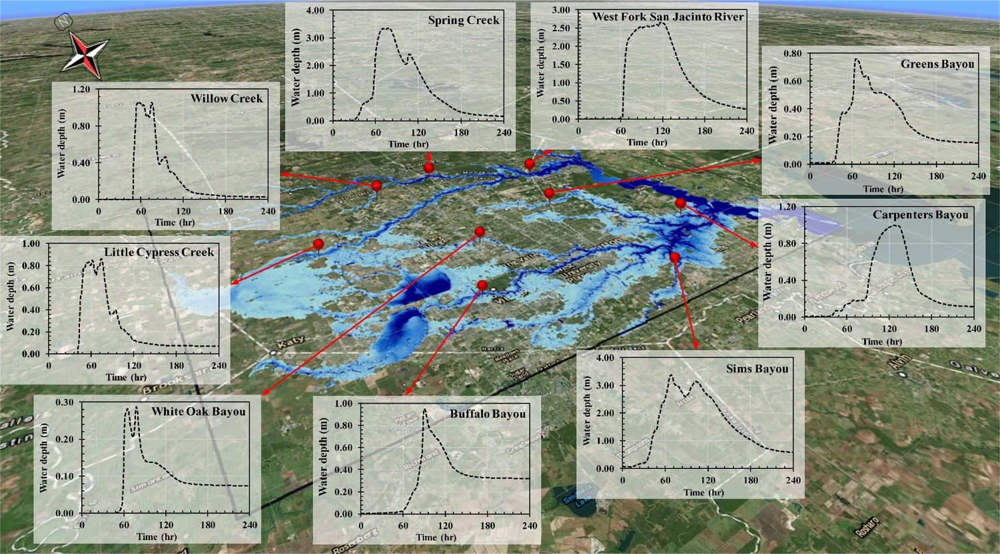

# TRITON: Two-dimensional Runoff Inundation Toolkit for Operational Needs

TRITON is an open-source, high-performance software framework for 2D flood simulation. Its core is a computationally efficient, physics-based hydraulic model that operates on a regular, structured grid and solves the full 2D shallow water equations.

## Features

- **Cross-platform and HPC ready**: Performance-portable via Kokkos. Runs on single or multiple CPUs (OpenMP + MPI) and supports GPU acceleration with Kokkos and MPI.
- **Flexible Forcing & Inputs** – Uses topographical data (e.g., DEM, LIDAR) on a uniform Cartesian grid and supports streamflow hydrographs, gridded runoff, or both as hydrological forcing.
- **Rich Output Options** – Produces water depth maps, 2D velocity maps, and unit discharge data, plus time series outputs at user-defined points and intervals.
- **Linux/Unix Native** – Built for Linux/Unix systems with input/output in ascii, binary and geotiff format.
- **SI Units Standard** – Operates using the International System of Units (SI).



## Repository Structure

```
triton/
├── doc/           # User guides, API references, and technical documentation
├── src/           # Core simulation source code
├── external/      # Kokkos Git submodule
├── input/         # Sample simulation input data files
├── test/          # Regression test suite based on CTest
├── cmake/         # CMake configuration modules and machine files
├── Makefile       # Commands to generate documentation and a TRITON Docker image
└── README.md      # Project overview and usage instructions
```

## Installation

TRITON can be built from source or run using a container.

### **Prerequisites**
CMake 3.16 or newer
C++17 compatible compiler
MPI libraries with C++ bindings
Optional: CUDA, HIP, or SYCL for GPU acceleration
Optional: GDAL for GeoTIFF support
Kokkos is included as a Git submodule. No system install is required.

### **Build Instructions**
```bash
git clone --recursive https://code.ornl.gov/hydro/triton.git
cd triton
mkdir build && cd build
cmake ..
./triton_build.sh


```
On success, triton.exe is created in the build directory.
For more details on cmake configurationa and compiler flags, please see the documentation. 

### **Using Docker (Optional)**
```bash
make docker_build
make docker_run

docker pull grnydawn/triton-mpich
```

## Running a Simulation

Run a sample case from the build directory using:
```bash
cd build

# run a pre-selected example case (Allatoona)
./triton_run.sh

# run Circular Dambreak
./triton_run.sh ./input/circular/circular_dambreak.cfg

# run Paraboloid
./triton_run.sh ./input/paraboloid/paraboloid.cfg

```

Simulation results will be stored in `output/`.

## Documentation

- [User Guide:T.B.D.]
- [API ReferenceT.B.D.]

Full documentation is also available at: [TRITON Documentation](https://triton.ornl.gov/documentation)

## Testing

TRITON includes regression tests:
```bash
./triton_ctest.sh
```

## Contributing

We welcome contributions!  

1. Fork the repository.  
2. Create a feature branch:  
   ```bash
   git checkout -b feature/my-new-feature
   ```
3. Commit your changes and open a Merge Request (MR).  

## License

TRITON is released under the **3-Clause BSD License**. See [LICENSE](LICENSE) for more details.

## Acknowledgments

Development of TRITON is supported by the U.S. Air Force Numerical Weather Modeling Program. TRITON used resources of the Oak Ridge Leadership Computing Facility at Oak Ridge National Laboratory, a U.S. Department of Energy user facility. Development is led by Oak Ridge National Laboratory, the University of Zaragoza (Spain), and Tennessee Technological University (Cookeville, TN).


## Contact

Questions, bug reports, or feature requests:
- Open a GitLab issue: <https://code.ornl.gov/hydro/triton/-/issues>
- Submit a support ticket: <https://triton.ornl.gov/contact/>
- Email: [Mario Morales Hernandez](mailto:mmorales@unizar.es), [Sudershan Gangrade](mailto:gangrades@ornl.gov)
